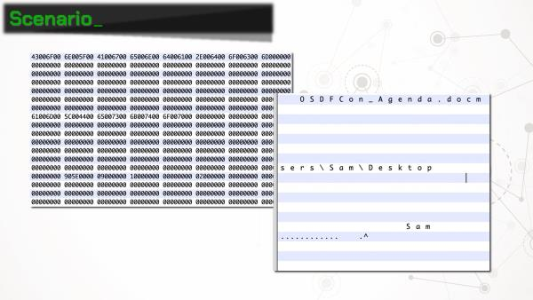
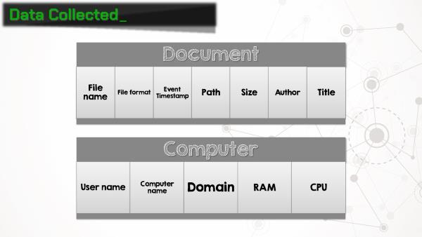
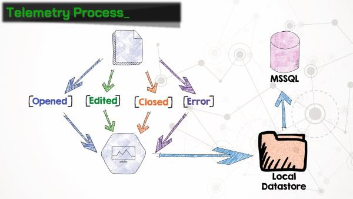

Microsoft Office Telemetry: Tracking Your Every Move
======

*Updated 10/19/2018*

Thanks to everyone for the great feedback from my presentation at [OSDFCon](https://www.osdfcon.org)! I've had a few requests for copies of the slides, and after taking a second look, I realized the slides are quite unhelpful without my yammering narration. Hopefully this post will provide both the slides and the context.

The Scenario
------

We've been provided three forensic images, each from a user's workstation at Reynholm Industries. The company wants to know which user modified an Excel spreadsheet stored on a Windows network share. We are only provided images of the workstations' hard drives (no memory images). Examination of these drives provides only inconclusive results. We are unable to obtain any information from the network share.

As a last ditch effort, the examiner searches the full drive images for each users' domain account names using [BulkExtractor](http://downloads.digitalcorpora.org/downloads/bulk_extractor/). One of the results is a binary file ("\Users\Roy\AppData\Local\Microsoft\Office\16.0\Telemetry\sln.tbl") containing UTF-16 strings that include a filename, path, and the user account name. Hmmmm, Microsoft Office Telemetry? Sounds interesting...

Cue: Office Telemetry
------

As it turns out, beginning with Office 2013, Microsoft has rolled out a feature called **telemetry**. Ostensibly, Office telemetry is a "Compatibility Monitoring Framework" for administrators to identify business-critical Office documents and add-ins, and test compatibility and performance with new versions of Office as they are released.

Telemetry was included in Office 2013 Pro Plus, and is included in Offie 2016 Standard, Pro Plus, and 365 Pro Plus. The telemetry agent software can also be installed in Office 2010, 2007, and 2003, although it was not included in those versions. The telemetry agent is also not included in any Office home, personal, student, or business versions, or any Office versions for the Mac.

Forensicate!
------

OK, so why does this matter for forensic examiners? Telemetry agent collects **a lot** of information about documents that the user interacts with. When a document is opened or closed, the file name, path, size, author, and title is recorded. The agent also collects a plethora of information about the computer on which it's running, including the computer name, domain, amount of RAM, CPU architecture, and user name under which the agent is running. Suddenly this Office feature gets a whole lot more interesting!

Telemetry works by installing the **telemetry agent** on the machine. The agent hooks into all of the Office applications and collects, well, telemetry data. So when a document is opened, closed, or an Office application crashes (wait, that happens?), the agent writes an entry in the telemetry log, which is saved on the local workstation. It can also be uploaded to an MSSQL database, but more on that later.

The "telemetry log" is actually a set of three binary files:
* **user.tbl**: information about the user, computer, and network
* **sln.tbl**: information about each document or add-in, including name, path, size, author, etc.
* **evt.tbl**: maps each item to an event code

Entries in the evt.tbl and sln.tbl files are correlated using a 64-bit GUID. A list of event codes that are referenced in evt.tbl can be found in the [documentation for this project](https://github.com/MadScientistAssociation/libmsot/blob/master/Documentation/Microsoft%20Office%20Telemetry%20Log%20(TBL)%20Format.md). The documentation also includes a listing of the various artifacts that we've parsed out of these files.

If you don't feel like nerding out and reading the docs, we've created a handy Python script that will parse out the entries from the telemetry files and output the results in a CSV.

There is a caveat to the amount of data stored in the telemetry log files. They are only designed to record information for  "recently used files." Well, that's nice and vague, so let's get more specific. Each .tbl file will grow to 5MB before overwriting entries. So "recent" means however long it takes to fill 5MB with log entries.

There's also an Autopsy module, which finds all groups of telemetry files on a data source, parses them, and outputs the results into the case as artifacts. This makes for great timelines!

Scaling Up
------

Earlier we touched on storing telemetry information in a SQL database. Any of the supported versions of Office include the ability to export an installer for **Telemetry Processor**, which collects telemetry logs from a network share and ingests them into MSSQL database. Office includes a handy **Telemetry Dashboard** application, which queries the database and displays reports. Each workstation needs to be configured to push its telemetry logs to the network share where the telemetry processor is monitoring. More on that next.

Telemetry agent can be installed on workstations in 3 ways:

1. Open the **Telemetry Log** application from Window and click the install button
2. Manually set the proper registry keys
3. Group policy

Running the installer directly from the telemetry log is the quickest and easiest way to get telemetry running, but registry and group policy objects allow for additional configuration options. For example, to upload collected logs to a network share, two registry keys need to be added or modified:

`HKEY_CURRENT_USER\Software\Microsoft\Office\16.0\OSM\enableupload` : enable uploading to a network location
`HKEY_CURRENT_USER\Software\Microsoft\Office\16.0\OSM\commonfileshare` : UNC path of network share

The full list of registry keys and group policy objects can be found in the [documentation for this project](https://github.com/MadScientistAssociation/libmsot/blob/master/Documentation/Microsoft%20Office%20Telemetry%20Log%20(TBL)%20Format.md).

Use Cases 
------

My initial idea for using Office telemetry data was to add to a forensic timeline. The telemetry log contains data that is either unavailable elsewhere, or requires a lot more work to reconstruct. Using the telemetry data, it's amazingly easy to show when a user opened Microsoft Word, opened their smoking-gun document, closed the document, and quit the application. Fantastic evidence if you can get it, assuming that the user happens to have telemetry enabled on their system.

Even better than the single-user use case, let's say we are tasked with forensic examination of machines across an enterprise, like in the original scenario posed in this post. If the enterprise is using Office telemetry and pushing the results to a SQL server (*-fingers crossed-*), we can get **tons** of data without even looking at the workstations. Just grab the database!

Even even better: the database does not automatically remove entries for computers that don't exist on the network anymore. So as machines are cycled on and off the network, telemetry information will persist. An organization's telemetry database could contain activity for users and computers that haven't been active in years! It is important to note that there is a telemetry database admin tool (tdadm), that can purge old records. So your results may vary based on the frugality of the organization's sysadmin.

We've established that telemetry data stored on a SQL server is extremely useful for investigators. How about when that data is stored in the cloud rather than on-premises? All three of the major cloud providers offer easy ways to get an MSSQL server up and running. This offers a method for investigators to recover detailed information about user activity on an organization's network without even stepping foot on the premises!

Finally, we considered the usefulness of Office telemetry data in an incident response context. An easy scenario to envision involves a user opening a malicious Office document. That document **hopefully** generates a security alert, and an incident response team is deployed to investigate. One of their first considerations will be how many users within the organization received and opened the same malicious document. Office telemetry data could provide an extremely fast way to determine the scope of the problem by simple searching the document name in the database.

We also had the idea that malicious macros or dynamic data exchange calls within Office documents may trigger some sort of telemetry log entries. Unfortunately, even though the testing process was fun, we were unable to generate any alerts. Macros and DDE's aren't recorded by telemetry. However, Microsoft recently started testing a feature allowing users to run custom Javascript functions from within Office documents. What could go wrong? It's unclear what, if any, effect this may have on telemetry logging, but there are certainly scenarios where malicious functions could be detected. Consider [this article](https://charles.dardaman.com/js_coinhive_in_excel) by Charles Dardaman. Imagine that an ambitious employee decides they are going to use their work computer to mine cryptocurrency. They don't have administrator rights, so installing mining software is out of the question. But they do have Excel installed, and there's a readily available Javascript function that allows that user to interact with Coinhive! 

One of the telemetry event functions is to alert when an Office application uses more than 90% of the CPU. Presumably this was added to watch for some add-in/application interaction that is not working properly. But conversely, if the Coinhive Javascript function is working well, it should attempt to utilize as many CPU cycles as possible (*and hopefully trigger this telemetry alert*).

Conclusion
------

There's certainly more work to be done in this area. Hopefully simple awareness will motivate more administrators to enable Office telemetry, and that will open up more possibilities for forensic investigators and incident responders. We plan on continuing research on artifacts contained within the telemetry logs, as well as what new features Office 365 might hold.

Finally, we are always looking for contributers! The open-source community is the backbone of the digital forensics field. Every new artifact and discovery that is published could be the key to solving an investigation. Pull requests are always welcome!

