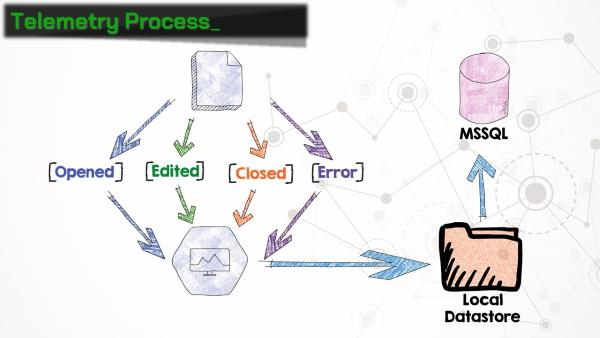
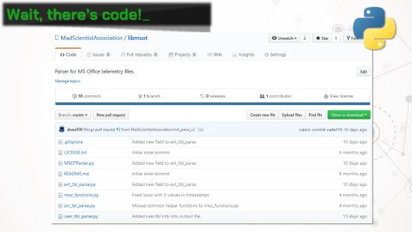
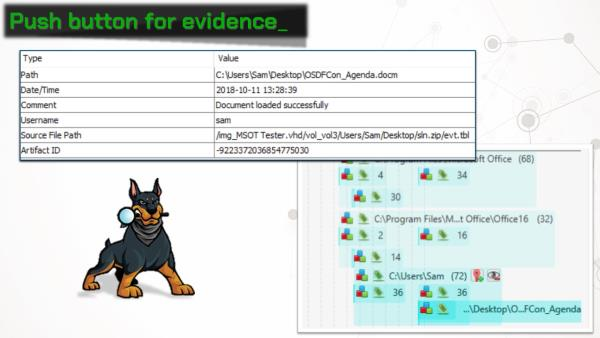
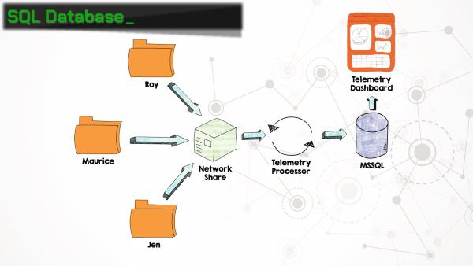
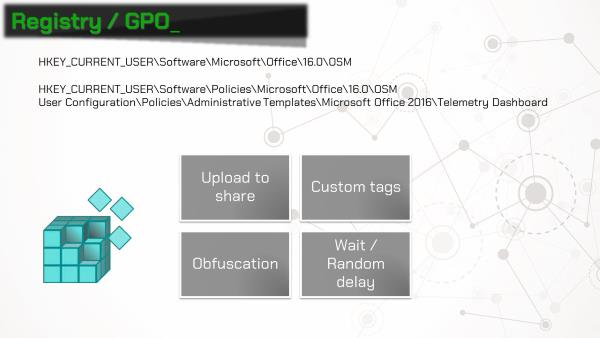

Microsoft Office Telemetry: Tracking Your Every Move
======

*Updated 10/19/2018*

Thanks to everyone for the great feedback from my presentation at [OSDFCon](https://www.osdfcon.org)! I've had a few requests for copies of the slides, and after taking a second look, I realized the slides are quite unhelpful without my yammering narration. Hopefully this post will provide both the slides and the context.

The Scenario
------

We've been provided three forensic images, each from a user's workstation at Reynholm Industries. The company wants to know which user modified an Excel spreadsheet stored on a Windows network share. We are only provided images of the workstations' hard drives (no memory images). Examination of these drives provides only inconclusive results. We are unable to obtain any information from the network share.

As a last ditch effort, the examiner searches the full drive images for each users' domain account names using [BulkExtractor](http://downloads.digitalcorpora.org/downloads/bulk_extractor/). One of the results is a binary file ("\Users\Roy\AppData\Local\Microsoft\Office\16.0\Telemetry\sln.tbl") containing UTF-16 strings that include a filename, path, and the user account name. Hmmmm, Microsoft Office Telemetry? Sounds interesting...

Cue: Office Telemetry
------

As it turns out, beginning with Office 2013, Microsoft has rolled out a feature called **telemetry**. Ostensibly, Office telemetry is a "Compatibility Monitoring Framework" for administrators to identify business-critical Office documents and add-ins, and test compatibility and performance with new versions of Office as they are released.

Telemetry was included in Office 2013 Pro Plus, and is included in Offie 2016 Standard, Pro Plus, and 365 Pro Plus. The telemetry agent software can also be installed in Office 2010, 2007, and 2003, although it was not included in those versions. The telemetry agent is also not included in any Office home, personal, student, or business versions, or any Office versions for the Mac.

Forensicate!
------

OK, so why does this matter for forensic examiners? Telemetry agent collects **a lot** of information about documents that the user interacts with. When a document is opened or closed, the file name, path, size, author, and title is recorded. The agent also collects a plethora of information about the computer on which it's running, including the computer name, domain, amount of RAM, CPU architecture, and user name under which the agent is running. Suddenly this Office feature gets a whole lot more interesting!

Telemetry works by installing the **telemetry agent** on the machine. The agent hooks into all of the Office applications and collects, well, telemetry data. So when a document is opened, closed, or an Office application crashes (wait, that happens?), the agent writes an entry in the telemetry log, which is saved on the local workstation. It can also be uploaded to an MSSQL database, but more on that later.

The "telemetry log" is actually a set of three binary files:
* **user.tbl**: information about the user, computer, and network
* **sln.tbl**: information about each document or add-in, including name, path, size, author, etc.
* **evt.tbl**: maps each item to an event code

Entries in the evt.tbl and sln.tbl files are correlated using a 64-bit GUID. A list of event codes that are referenced in evt.tbl can be found in the [documentation for this project](https://github.com/MadScientistAssociation/libmsot/blob/master/Documentation/Microsoft%20Office%20Telemetry%20Log%20(TBL)%20Format.md). The documentation also includes a listing of the various artifacts that we've parsed out of these files.

If you don't feel like nerding out and reading the docs, we've created a handy Python script that will parse out the entries from the telemetry files and output the results in a CSV.

There's also an Autopsy module, which finds all groups of telemetry files on a data source, parses them, and outputs the results into the case as artifacts. This makes for great timelines!

Scaling Up
------

Earlier we touched on storing telemetry information in a SQL database. Any of the supported versions of Office include the ability to export an installer for **Telemetry Processor**, which collects telemetry logs from a network share and ingests them into MSSQL database. Office includes a handy **Telemetry Dashboard** application, which queries the database and displays reports. Each workstation needs to be configured to push its telemetry logs to the network share where the telemetry processor is monitoring. More on that next.

Telemetry agent can be installed on workstations in 3 ways:

1. Open the **Telemetry Log** application from Window and click the install button
2. Manually set the proper registry keys
3. Group policy

Running the installer directly from the telemetry log is the quickest and easiest way to get telemetry running, but registry and group policy objects allow for additional configuration options. For example, to upload collected logs to a network share, two registry keys need to be added or modified:

`HKEY_CURRENT_USER\Software\Microsoft\Office\16.0\OSM\enableupload` : enable uploading to a network location
`HKEY_CURRENT_USER\Software\Microsoft\Office\16.0\OSM\commonfileshare` : UNC path of network share

The full list of registry keys and group policy objects can be found in the [documentation for this project](https://github.com/MadScientistAssociation/libmsot/blob/master/Documentation/Microsoft%20Office%20Telemetry%20Log%20(TBL)%20Format.md).

Use Cases 
------

