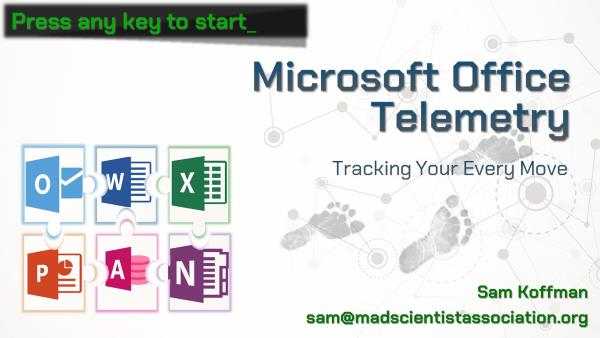
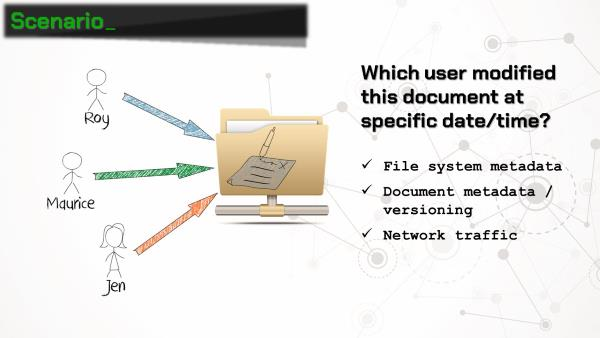
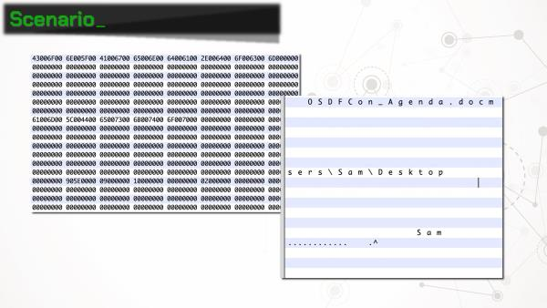
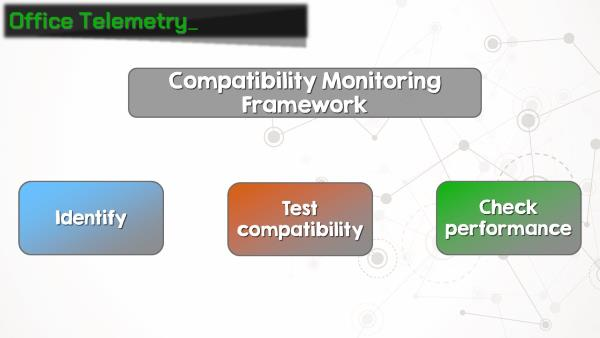
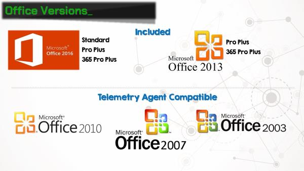
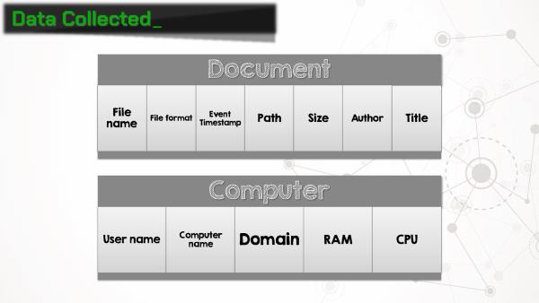

Microsoft Office Telemetry: Tracking Your Every Move
======

*Updated 10/19/2018*

Thanks to everyone for the great feedback from my presentation at [OSDFCon](https://www.osdfcon.org)! I've had a few requests for copies of the slides, and after taking a second look, I realized the slides are quite unhelpful without my yammering narration. Hopefully this post will provide both the slides and the context.

The Scenario
------

We've been provided three forensic images, each from a user's workstation at Reynholm Industries. The company wants to know which user modified an Excel spreadsheet stored on a Windows network share. We are only provided images of the workstations' hard drives (no memory images). Examination of these drives provides only inconclusive results. We are unable to obtain any information from the network share.

As a last ditch effort, the examiner searches the full drive images for each users' domain account names using [BulkExtractor](http://downloads.digitalcorpora.org/downloads/bulk_extractor/). One of the results is a binary file ("\Users\Roy\AppData\Local\Microsoft\Office\16.0\Telemetry\sln.tbl") containing UTF-16 strings that include a filename, path, and the user account name. Hmmmm, Microsoft Office Telemetry? Sounds interesting...

As it turns out, beginning with Office 2013, Microsoft has rolled out a feature called **telemetry**. Ostensibly, Office telemetry is a "Compatibility Monitoring Framework" for administrators to identify business-critical Office documents and add-ins, and test compatibility and performance with new versions of Office as they are released.

Telemetry was included in Office 2013 Pro Plus, and is included in Offie 2016 Standard, Pro Plus, and 365 Pro Plus. The telemetry agent software can also be installed in Office 2010, 2007, and 2003, although it was not included in those versions. The telemetry agent is also not included in any Office home, personal, student, or business versions, or any Office versions for the Mac.

OK, so why does this matter for forensic examiners? Telemetry agent collects **a lot** of information about documents that the user interacts with. When a document is opened or closed, the file name, path, size, author, and title is recorded. The agent also collects a plethora of information about the computer on which it's running, including the computer name, domain, amount of RAM, CPU architecture, and user name under which the agent is running. Suddenly this Office feature gets a whole lot more interesting!

